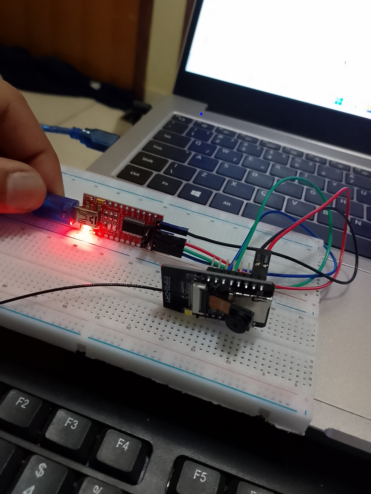

# FIAP - Faculdade de Informática e Administração Paulista

<p align="center">
<a href= "[https://www.fiap.com.br/](https://www.fiap.com.br/)"></a>
</p>

# FarmTech Vision: Detecção Inteligente em Pecuária

## 👨‍🎓 Integrantes:

* <a href="[https://www.linkedin.com/in/renan-wesler-nunes-06a89a325](https://www.linkedin.com/in/renan-wesler-nunes-06a89a325)">Renan Wesler Nunes - RM562839</a>

## 👩‍🏫 Professores:

### Tutor(a)

* <a href="[https://www.linkedin.com/in/lucas-gomes-moreira-15a8452a/](https://www.linkedin.com/in/lucas-gomes-moreira-15a8452a/)">Lucas Gomes Moreira</a>

## 📜 Descrição

**FarmTech Vision** é uma solução de baixo custo e alta eficiência que utiliza Inteligência Artificial para a detecção de objetos em ambientes de pecuária. O projeto foi desenvolvido para o desafio da FIAP, aplicando visão computacional para aumentar a segurança e o monitoramento em fazendas e haras.

Utilizando um microcontrolador **ESP32-CAM**, o sistema captura imagens, processa localmente com um modelo de detecção de objetos (**YOLOv5**) e envia os resultados da detecção (classes e coordenadas) via comunicação serial para um computador (PC) através de um adaptador **FTDI/USB**, permitindo o monitoramento direto no terminal do **VSCode**.

## 🏛️ Arquitetura da Solução

1.  **Captura (Hardware):** O **ESP32-CAM** é responsável por capturar as imagens do ambiente.
2.  **Processamento (Embarcado):** Um modelo de IA (**YOLOv5**), otimizado para microcontroladores, roda diretamente no ESP32-CAM para detectar objetos de interesse (pessoas, cavalos, cercas).
3.  **Comunicação (Serial):** As detecções são enviadas via **USB** (usando um adaptador **FTDI**) para o computador, onde podem ser lidas pelo Monitor Serial do VSCode (PlatformIO).

## 🤖 Treinamento do Modelo

O coração do projeto é um modelo de detecção de objetos **YOLOv5** customizado.

1.  **Coleta e Anotação:** Coletamos um dataset focado em nosso problema. A demarcação das imagens (criação de *bounding boxes* para "pessoa", "cavalo" e "cerca") foi realizada utilizando a plataforma online **[Make Sense (makesense.ai)](https://www.makesense.ai/)**.
2.  **Dataset:** Para provar a eficácia do modelo mesmo com poucos dados, utilizamos um dataset pequeno e focado:
    * **Imagens de Treino:** 60
    * **Imagens de Validação:** 6
    * **Imagens de Teste:** 3
3.  **Treinamento:** O modelo foi treinado no Google Colab, aproveitando as GPUs gratuitas. O processo permitiu ajustar o modelo YOLOv5 para nosso dataset específico, resultando em um arquivo `.tflite` otimizado para rodar no ESP32-CAM.

Para uma explicação técnica detalhada de todo o processo de treinamento, acesse nosso notebook no Google Colab:

* **[Link do Colab: Treinamento YOLOv5 para ESP32-CAM](https://colab.research.google.com/drive/1z8fUb6p6cIjvZCeJ-0F0fC_ghJa264QP#scrollTo=L8FKPkXTNnuN)**

### Resultados do Modelo (Imagens de Teste)

O desempenho do modelo nas 3 imagens de teste (que ele nunca viu durante o treino ou validação) pode ser visto abaixo:

| Teste 1 | Teste 2 | Teste 3 |
| :---: |:---:|:---:|
|  |  |  |

## 📸 Hardware Utilizado

A solução foi implementada com hardware de baixo custo e fácil acesso, demonstrando a viabilidade do projeto.

| Hardware - Vista Superior | Hardware - Vista Lateral |
| :---: |:---:|
|  |  |

## 📁 Estrutura de Pastas (Simplificada)


/
├── assets/
│   ├── IMG_20251020_173919.jpg
│   ├── IMG_20251020_174053.jpg
│   ├── TESTE_1.jpg
│   ├── TESTE_2.jpg
│   └── TESTE_6.jpg
├── src/
│   └── main.ino
|   images/
| 
├── platformio.ini
└── README.md


## Vídeo Explicativo

Assista ao vídeo para ver o projeto em ação e entender melhor seu funcionamento.

[**https://youtu.be/l6xmsXkHltk?feature=shared**](https://youtu.be/l6xmsXkHltk?feature=shared)

## 🔧 Como Executar

### Pré-requisitos

* Arduino IDE ou **PlatformIO** (recomendado, usado no projeto).
* Placa **ESP32-CAM**.
* Adaptador **FTDI** (para programar e comunicar via USB).

### Instalação

1.  **Clone o repositório:**
    ```bash
    git clone https://github.com/W-Nunes/FarmTech-Vision.git
    cd FarmTech-Vision
    ```

2.  **Abra o projeto:**
    * Abra a pasta do projeto no **VS Code** com a extensão PlatformIO.

3.  **Configure o `main.ino`:**
    * Insira as credenciais da sua rede Wi-Fi (necessário para o setup inicial da câmera, se aplicável).

4.  **Compile e envie:**
    * Conecte o ESP32-CAM ao computador através do adaptador FTDI (Lembre-se de ligar o pino `IO0` ao `GND` para entrar em modo de *flash*).
    * Use o PlatformIO para compilar e enviar o código para a placa (botão "Upload").

5.  **Monitore:**
    * Após o upload, **remova o pino `IO0` do `GND`** e reinicie o ESP32-CAM.
    * No VSCode/PlatformIO, abra o **"Serial Monitor"**. Você verá os dados da detecção (classes e coordenadas) sendo impressos no terminal em tempo real.

## 📋 Licença

<p xmlns:cc="[http://creativecommons.org/ns#](http://creativecommons.org/ns#)" xmlns:dct="[http://purl.org/dc/terms/](http://purl.org/dc/terms/)"><a property="dct:title" rel="cc:attributionURL" href="[https://github.com/agodoi/template](https://github.com/agodoi/template)">MODELO GIT FIAP</a> por <a rel="cc:attributionURL dct:creator" property="cc:attributionName" href="[https://fiap.com.br](https://fiap.com.br)">Fiap</a> está licenciado sobre <a href="[http://creativecommons.org/licenses/by/4.0/?ref=chooser-v1](http://creativecommons.org/licenses/by/4.0/?ref=chooser-v1)" target="_blank" rel="license noopener noreferrer" style="display:inline-block;">Attribution 4.0 International</a>.</p>
